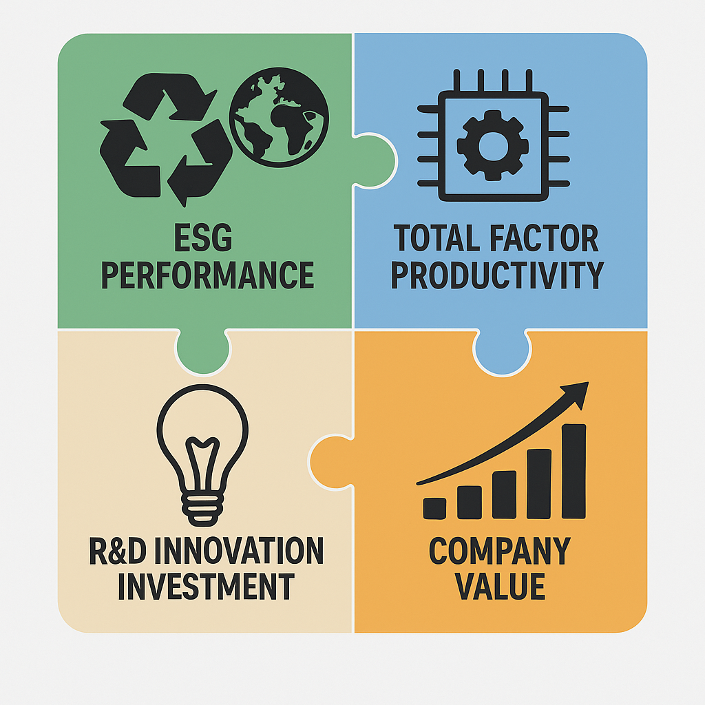

<!-- category: 文章解读 -->
<!-- language: 中文 -->
<!-- template: research-explainer -->
<!-- review-status: SAMPLE_ONLY_NOT_FOR_PUBLICATION -->

# ESG投入会成为成本，还是转化为企业价值？生产率与研发给出的答案

> 企业改善环境、社会与治理表现之后，价值究竟从哪里来？这项研究把全要素生产率放在中间，把研发投入作为条件变量，试图打开“ESG表现—企业价值”之间的机制黑箱。<!-- source:S1,S2 -->

## 文章信息

- **中文题名：** ESG如何创造价值？全要素生产率与研发创新的中介与调节路径<!-- source:S1,S2 -->
- **英文题名：** *ESG’s Path to Value: The Role of Total Factor Productivity and R&D Innovation Investment*<!-- source:S1,S2 -->
- **发表期刊：** *Journal of Chinese Economic and Business Studies*<!-- source:S1,S2 -->
- **作者：** Guoyu Mao、Tharitsaya Kongkaew<!-- source:S1,S2 -->
- **相关可持续发展目标：** SDG 9“产业、创新和基础设施”、SDG 12“负责任消费和生产”；这是原编辑稿采用的主题映射。<!-- source:S1 -->

## 作者信息

原编辑稿显示，Guoyu Mao的研究和工作背景涉及会计、公司财务及相关实践；Tharitsaya Kongkaew任职于泰国皇家理工大学，研究方向涉及财务管理、投资策略与公司金融。人物职务具有时效性，真实发布时应以作者主页或所在机构当前页面为准。<!-- source:S1 -->

## 研究问题：ESG为何可能创造价值？

环境、社会与治理（environmental, social and governance，ESG）并不是一笔天然能够产生回报的投资。企业改善能源使用、员工保障、供应链责任或治理制度，需要投入资金与管理资源。支持者认为，这些投入可以降低风险、改善利益相关者关系、增强声誉并缓解融资约束；怀疑者则担心，ESG活动会挤占生产和创新资源，或者停留在披露层面，不能形成真正的经营能力。于是，关键问题不能只问“ESG与企业价值是否相关”，还要追问：价值通过什么环节形成，又需要哪些配套条件？<!-- source:S1,S2 -->

文章把全要素生产率（total factor productivity，TFP）视为第一条机制。TFP关注的是在资本、劳动等投入之外，企业通过技术、管理、组织和资源配置效率所获得的产出改善。如果ESG促使企业减少浪费、优化流程、改善员工合作或降低经营摩擦，那么它可能先表现为生产率提升，再被资本市场或经营结果吸收为企业价值。这里的逻辑不是“披露一份ESG报告就能提高估值”，而是ESG实践必须改变企业使用资源的方式。<!-- source:S1,S2 -->

第二个关键变量是研发创新投入（R&D innovation investment）。研发一方面可能帮助企业把环保要求和社会责任转化为新产品、新工艺或更高效的生产系统；另一方面，研发本身具有周期长、结果不确定和资源占用高的特点。因此，研发可能强化ESG与企业价值的协同，也可能改变ESG通过生产率发挥作用的具体路径。文章据此提出直接效应、中介效应、调节效应和调节中介效应四组假设。<!-- source:S1,S2 -->

## 数据与方法：怎样识别这条价值路径？

研究使用中国A股非金融上市公司的非平衡面板数据，样本期为2012—2022年，共包含31,310个公司—年度观测值。数据主要来自CSMAR与Wind；ESG表现采用华证ESG评级的季度评分并转化为年度均值，公司价值使用Tobin’s Q衡量，TFP采用Levinsohn–Petrin方法估算，研发投入则以研发总支出的对数表示。模型还控制企业规模、年龄、成长性、财务状况和治理结构，并纳入年度、行业与个体固定效应。<!-- source:S1,S2 -->

文章的识别策略可以分为三层。第一层检验ESG表现与企业价值的总体关系。第二层使用中介效应框架，分别估计ESG对TFP、TFP对企业价值以及加入TFP后ESG系数的变化。第三层加入ESG与研发投入的交互项，并进一步考察研发投入是否改变“ESG—TFP—企业价值”这条间接路径。这样的安排比单一回归多走了一步：它不只判断两个变量是否同向变化，还尝试说明这种变化可能通过何种经营机制发生。<!-- source:S1,S2 -->

不过，中介与调节模型本身并不会自动产生因果识别。固定效应、滞后变量和工具变量可以缓解部分反向因果与遗漏变量问题，但读者仍需关注ESG评级误差、工具变量排除限制以及企业主动选择ESG投入的可能性。换句话说，模型为机制提供系统证据，却不能把所有制度环境中的ESG投资都解释为同一种因果过程。<!-- source:S1,S2 -->

_图1 ESG表现通过全要素生产率与研发创新投入影响企业价值的研究框架_
<!-- caption-decision: user-confirmed-add -->
<!-- image-source: S1, 用户提供的编辑材料 -->

## 核心结论：直接作用与间接作用同时存在

第一，研究报告ESG表现与企业价值显著正相关。在纳入企业特征、治理变量和固定效应后，这一关系仍然存在。它支持了文章的基本判断：样本中的ESG改善并非只表现为额外成本，而是与更高的公司价值相联系。但这一结果应当连同样本范围和模型设定一起理解，不能直接外推为任何企业、任何时期提升ESG评分都必然增加价值。<!-- source:S1,S2 -->

第二，TFP构成部分中介。文章发现，ESG表现与更高的TFP相关，而TFP又与企业价值正相关；在模型中加入TFP后，ESG的主效应有所下降但仍保持显著。这意味着研究估计的价值路径不是单一的：一部分可能经由生产效率传递，另一部分仍可能来自融资、声誉、风险管理或其他没有被TFP完全捕捉的渠道。<!-- source:S1,S2 -->

第三，研发投入强化了ESG与企业价值之间的正向关系。ESG与研发投入的交互项为正，说明在研发投入较高的企业中，ESG表现与企业价值之间的正向联系更强。这一发现符合“互补性”解释：当企业拥有研发能力时，环境与社会目标更可能转化为工艺升级、产品创新或资源利用效率，而不是停留在合规和披露层面。<!-- source:S1,S2 -->

第四，研发对中介链条的影响并不是每一段都同向。原编辑稿指出，研发投入对“ESG影响TFP”这一段呈负向调节，却强化了“TFP影响企业价值”这一段；综合起来，高研发投入情形下，经由TFP形成的间接价值效应更强。这个结果提醒读者：调节中介不是一句“研发越多越好”，而是研发改变了ESG投入被吸收、转化并最终被市场定价的方式。<!-- source:S1,S2 -->

第五，行业异质性显示，相关协同在高技术行业和制造业样本中更加明显。制造业通常面临更直接的能源、排放、设备和供应链约束，研发也更容易与工艺和产品改进发生联系，因此ESG、生产率与研发之间的互补关系可能更容易被观察到。该解释与结果相符，但行业差异仍可能受到样本构成、监管强度和资本密集程度等因素影响。<!-- source:S1,S2 -->

## 文章贡献：从“有没有价值”推进到“怎样形成价值”

文章的第一项贡献，是把TFP引入ESG价值研究。相比只讨论融资成本、企业声誉或风险溢价，生产率机制更接近企业内部的资源配置和经营过程。它让ESG研究与生产率研究产生连接，也为检验“实质性ESG改善”和“仅有披露改善”提供了可继续发展的分析入口。<!-- source:S1,S2 -->

第二项贡献，是把研发投入放进同一机制框架。研究没有把创新简单视为另一个结果变量，而是考察创新投入如何改变ESG的直接效应和间接效应。这种设计强调战略之间的互补性：ESG政策、生产效率和研发决策不一定是彼此独立的管理模块，它们可能共同决定资源是否真正转化为企业价值。<!-- source:S1,S2 -->

第三项贡献，是利用行业异质性检验说明机制可能依赖生产场景。高技术企业和制造业企业对技术、设备、能源与供应链的依赖不同于轻资产行业，因此同样的ESG投入可能通过不同渠道起作用。文章提供了这种差异的经验证据，但更严格的行业比较仍需要在制度、规模和选择效应方面继续识别。<!-- source:S1,S2 -->

## 稳健性、异质性与局限

研究通过替换变量度量、使用滞后解释变量以及工具变量等方式进行稳健性和内生性检验。例如，文章使用替代公司价值指标、改变TFP估计方法，并以行业平均ESG作为工具变量。不同设定下主要结论保持一致，为结果并非完全由单一指标或模型选择驱动提供了支持。<!-- source:S1,S2 -->

这些检验仍有边界。首先，ESG评级机构的指标构造和覆盖范围可能影响测量结果；年度均值也可能掩盖企业在一年内的快速变化。其次，研发总支出更接近创新投入数量，不能直接说明专利质量、工艺突破或商业化效率。再次，行业平均ESG能否完全满足排除限制需要结合行业共同冲击判断。最后，样本集中于中国A股非金融上市公司，制度环境、披露要求和投资者结构都会限制国际外推。<!-- source:S1,S2 -->

因此，本文更稳妥的表述是：在该样本和模型中，ESG表现、TFP、研发投入与企业价值呈现出与理论机制一致的系统关系，并通过多种检验得到支持；它不能单独证明任何ESG项目都会产生正回报，也不能替代企业层面对项目成本、执行能力和创新质量的具体评估。<!-- source:S1,S2 -->

## 实践意义：不同主体应该看到什么？

**对企业管理者而言，**ESG不应被当成孤立的披露任务。更有价值的做法是把环境和社会目标嵌入生产流程、采购标准、技术改造和研发组合，并用能源效率、损耗、员工稳定性、创新产出等经营指标跟踪实施效果。研究所揭示的生产率通道说明，只有进入资源配置过程的ESG战略，才更可能形成可持续的价值逻辑。<!-- source:S1,S2 -->

**对投资者而言，**单看ESG评级可能不足以判断长期价值。投资分析还应关注企业是否具有将ESG目标转化为生产率和创新成果的能力，例如研发强度、专利质量、资本开支方向、供应链治理和信息披露一致性。高ESG评分与高研发投入的组合值得关注，但仍要区分有效研发与低效率投入。<!-- source:S1,S2 -->

**对政策制定者和评级机构而言，**行业差异意味着统一指标可能无法完整呈现企业的实际转型。制造业、高技术行业和轻资产行业面对的环境约束、创新周期与可测成果不同。政策和评级体系可以在保持可比性的同时，提高对行业实质性指标、技术改造和创新质量的识别能力，并减少企业只追求评分而忽略经营改善的激励。<!-- source:S1,S2 -->

## 未来研究

后续研究可以沿三条路径推进。其一，把综合ESG评级拆分为环境、社会与治理维度，识别究竟是哪一类实践影响生产率。其二，用专利被引、绿色专利、工艺升级或创新销售收入等指标替代单纯的研发支出，区分创新投入与创新质量。其三，扩展到不同国家、所有制和监管环境，检验机制是否随信息披露制度、资本市场结构和产业政策变化。还可以使用更细粒度的项目数据或准自然实验，增强对因果路径和时间顺序的识别。<!-- source:S1,S2 -->

<!-- 编辑提示：请在公众号编辑器内从已发布的往期文章复制完整固定结尾 包括往期精彩文章 CEA介绍 JCEBS介绍和关注提示
Editor note: In the WeChat editor copy the complete fixed ending from a previously published article including Previous Highlights the CEA introduction the JCEBS introduction and the follow prompt -->

<!-- 图片来源：QR_code-png/扫码_搜索联合传播样式-标准色版.png
Image source: QR_code-png/扫码_搜索联合传播样式-标准色版.png -->
<!-- image-source: 品牌资产 QR_code-png/扫码_搜索联合传播样式-标准色版.png -->
