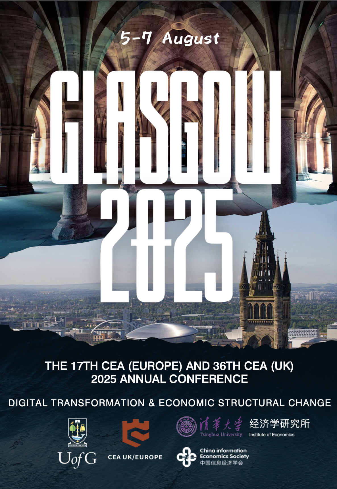

<!-- category: 会议通知 -->
<!-- language: 中文 -->
<!-- template: notice-opportunity -->
<!-- review-status: SAMPLE_ONLY_NOT_FOR_PUBLICATION -->

# 历史会议样例｜数字化转型与经济结构变革：CEA 2025格拉斯哥年会

> 第17届CEA（Europe）与第36届CEA（UK）年会于2025年8月5日至7日在英国格拉斯哥大学举行。会议以“数字化转型与经济结构变革”为主题，讨论数字技术、人工智能、绿色金融与全球价值链等议题。<!-- source:S1,S2 -->

<!-- 编辑提示：本样例会议已经结束 历史邮箱电话会场和议程不得作为当前信息发布
Editor note: The conference in this sample has ended Historical contacts venue and programme details must not be published as current information -->

## 关键信息

- **会议名称：** 第17届CEA（Europe）与第36届CEA（UK）年会<!-- source:S1,S2 -->
- **会议主题：** 数字化转型与经济结构变革<!-- source:S1,S2 -->
- **历史时间：** 2025年8月5日至7日<!-- source:S1,S2 -->
- **历史地点：** 英国格拉斯哥大学，相关活动分布于Adam Smith Business School、James McCune Smith Learning Hub和Glasgow Grosvenor Hotel<!-- source:S1,S2 -->
- **活动形式：** 主旨报告、圆桌论坛、平行分会场、期刊交流、博士生市场和社交活动<!-- source:S1,S2 -->
- **当前状态：** 已结束，不接受报名或投稿<!-- source:S1,S2 -->

_图1 CEA 2025格拉斯哥年会历史海报_
<!-- caption-decision: user-confirmed-add -->
<!-- image-source: S1,S2, 用户提供的会议材料 -->

## 背景与主题：数字化如何改变经济结构？

历史会议材料把数字化转型放在经济增长、结构调整和可持续发展的共同框架中。讨论重点不是单一技术，而是数字技术、数据分析、人工智能与智能系统进入企业、金融市场和公共治理之后，如何改变劳动需求、资本配置、供应链组织与风险传导。<!-- source:S1,S2 -->

议题覆盖ESG与绿色金融、人工智能和劳动力市场、自然灾害与气候政策、数字化与全球价值链、金融科技与区块链、资产定价和行为金融，以及数字政府与绿色转型等方向。这种设置体现了会议的跨领域特征：数字化既是生产工具，也是新的研究对象和政策变量。<!-- source:S1,S2 -->

历史预告列出了来自计量经济学、统计与量化金融、宏观金融、创新管理、国际贸易和数字经济等方向的学者。通知类稿件介绍嘉宾时，应同时核对姓名、事件发生时的单位与职务、报告题目和出席状态；仅有宣传稿而没有最终议程时，不能把“受邀”写成“已出席”。<!-- source:S1,S2 -->

## 面向对象与征稿范围

从议程内容看，会议主要面向经济学、金融学、管理学及相关交叉领域的研究者、博士生和青年学者。适合的研究主题包括绿色金融、企业ESG、人工智能与金融、数字经济、宏观政策、碳中和、国际贸易、供应链和发展经济学等。<!-- source:S1,S2 -->

博士生市场为青年研究者提供展示论文和建立学术联系的专门场景。对读者而言，完整会议通知应清楚区分普通参会、论文投稿、博士生市场申请和受邀报告等不同通道，并分别说明资格、材料、截止日期和结果通知方式。历史材料没有完整保留每个通道的当前有效要求，因此本样例不补造。<!-- source:S1,S2 -->

## 重要日程与会议日程

### 8月5日：注册与青年学者活动

历史材料安排参会注册、Job Market特别论坛、嘉宾接待与Welcome Drinks。这一天兼具报到和学术网络建立功能，参会者需要提前确认注册地点、证件领取和不同活动是否需要单独报名。<!-- source:S1,S2 -->

### 8月6日：开幕、主旨报告与圆桌交流

议程包括开幕式、主旨演讲、期刊介绍和银行圆桌。历史材料还安排当日晚间在Glasgow Grosvenor Hotel举行Gala Dinner。真实通知必须标明各活动准确开始时间、会场、着装或费用要求，并说明晚宴是否包含在注册中。<!-- source:S1,S2 -->

### 8月7日：平行论坛

最后一天以平行分会场和青年学者活动为主，议题延伸到绿色金融、气候金融、企业ESG、国际贸易、数字经济和发展经济学。平行议程信息量大，排版时宜按时间—会场—主题组织，而不是把所有报告题目堆在一个段落中。<!-- source:S1,S2 -->

## 如何参与：一份可执行通知需要哪些信息？

如果把本样例改写为新的会议通知，应按以下顺序整理：

1. 从主办方最新页面确认会议名称、届次、日期、时区、地点和举办形式。
2. 区分论文投稿、参会注册、博士生市场、晚宴和住宿等通道，分别记录截止日期及费用。
3. 列出摘要或全文格式、文件命名、主题分类、作者信息和提交系统。
4. 只使用当前官方报名或投稿链接；短链接、二维码和邮箱都要实际打开或发送测试。
5. 将议程版本号和核验日期写入来源台账，发生更新时说明哪些字段被替换。

历史材料曾列出会议官网、专用邮箱和联系电话，但这些渠道已过期或有效性未知，因此本稿不把它们作为行动入口。通知类写作的原则是：少一个未核实链接，优于给读者一个可能失效的链接。<!-- source:S1,S2 -->

## 为什么值得关注这类会议？

会议议题把数字化与绿色转型放在同一框架中，反映经济研究越来越需要同时处理技术变化、环境约束和国际经济联系。对成熟研究者，会议提供跨主题交流和期刊沟通机会；对博士生，平行论坛与Job Market活动可以帮助了解研究选题、表达方式和学术劳动力市场。这里的“价值”是根据活动结构作出的编辑性解释，不应被写成对参会效果的保证。

从信息组织角度看，一份完整会议通知还承担匹配功能。研究者需要据此判断主题是否契合、材料是否准备充分以及不同参与通道之间有什么区别。将征稿、注册、博士生市场和现场活动分别说明，可以减少读者因信息混杂而错过适合自己的环节，也能让主办方的正式安排得到更准确的传播。

<!-- 编辑提示：请在公众号编辑器内从已发布的往期文章复制完整固定结尾 包括往期精彩文章 CEA介绍 JCEBS介绍和关注提示
Editor note: In the WeChat editor copy the complete fixed ending from a previously published article including Previous Highlights the CEA introduction the JCEBS introduction and the follow prompt -->

<!-- 图片来源：QR_code-png/扫码_搜索联合传播样式-标准色版.png
Image source: QR_code-png/扫码_搜索联合传播样式-标准色版.png -->
<!-- image-source: 品牌资产 QR_code-png/扫码_搜索联合传播样式-标准色版.png -->
