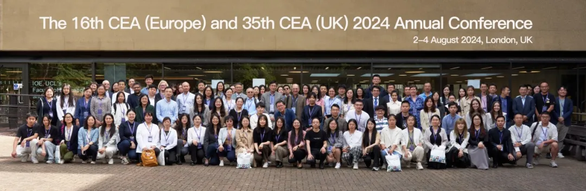

<!-- category: 新近动态 -->
<!-- language: 中文 -->
<!-- template: association-news -->
<!-- review-status: SAMPLE_ONLY_NOT_FOR_PUBLICATION -->

# 历史回顾｜从气候计量到可持续金融：CEA 2024年会在伦敦举行

> 2024年8月2日至4日，全欧/全英中国经济学会年会在伦敦大学学院举行。会议以“构建可持续和有韧性的经济”为主题，吸引来自中国、英国、德国、法国、爱尔兰、澳大利亚和埃及等国家的120余位参会者。<!-- source:S1 -->

> **时效说明：** 这是一篇历史动态写作样例。人物职务、学会届次和期刊信息均按事件材料表述，不代表当前状态。

_图1 CEA 2024年会现场_
<!-- caption-decision: user-confirmed-add -->
<!-- image-source: S1, 历史公众号文章 -->

## 会议概况：以韧性与可持续性连接多个研究领域

本届年会把“可持续”和“有韧性”放在同一主题中。前者关注经济活动如何在资源和环境约束下长期运行，后者则强调经济系统面对气候、金融或其他冲击时的承受与恢复能力。会议内容由主旨报告、期刊编辑圆桌和平行论坛构成，既讨论宏观层面的气候风险与政策，也涉及企业ESG、可持续金融、数字经济和不平等等微观与结构性议题。<!-- source:S1 -->

开幕式上，伦敦大学学院巴特莱特学院副院长D'Maris Coffman与学会第35届年会主席于晓华分别致辞。历史稿件记录的是事件发生时的身份；若文章重新发布，应核对职务是否需要保留“时任”限定。<!-- source:S1 -->

## 学术议题：七场主旨报告展开多维对话

会议邀请7位主旨报告人，研究领域覆盖气候变化的经济影响、气候计量经济学、生态经济学、可持续金融、能源经济学和社交媒体等方向。与其简单排列嘉宾头衔，更值得观察的是这些议题之间的联系：气候变化不仅关系环境结果，也会通过资产价格、企业投资、能源结构和公共政策进入经济分析。<!-- source:S1 -->

D'Maris Coffman的学术背景涉及结构变化与经济发展；Robert Costanza长期研究生态经济学和生态系统服务；杜慧滨的研究与管理工作涉及复杂环境与经济问题；David F. Hendry在计量经济学，特别是模型设定和气候计量研究方面具有重要影响。Ruben Enikolopov、侯文轩和Richard Tol的研究与编辑经历则把政治经济、金融、能源和气候议题带入会议讨论。以上人物信息来自历史会议稿，正式再发布需按当时官方议程逐项核对。<!-- source:S1 -->

这些主旨报告共同说明，可持续发展不是一个单独的“绿色”分支。气候冲击如何测量、企业如何融资、政策如何传导、生态系统价值怎样进入决策，以及信息环境如何影响社会选择，都需要不同经济学工具共同参与。这里是对议程结构的编辑性概括，不代表会议形成了统一结论。

## 关键内容：编辑圆桌与六场平行论坛

编辑圆桌邀请多本期刊的编辑交流学术发表。历史材料提到的期刊涉及生态经济、能源与气候、金融和结构变化等领域。圆桌的实际价值不在于提供“投稿捷径”，而在于帮助研究者理解：不同期刊如何界定问题贡献，跨学科研究需要怎样连接理论和证据，作者又应如何回应审稿中有关识别、外部效度与政策含义的质疑。<!-- source:S1 -->

会议设置6场平行论坛，讨论气候变化经济学、数字经济、环境社会与治理、经济发展与不平等以及可持续发展目标等议题。平行论坛让不同阶段的研究者展示正在推进的工作，也为主旨报告中的宏观问题提供更具体的经验研究和方法讨论。<!-- source:S1 -->

从内容结构看，数字经济与ESG并非彼此分离。数字技术可能帮助企业测量排放、追踪供应链和提高资源效率，也可能带来能源消耗、平台权力和新的不平等问题。会议将这些主题并置，为研究者比较不同机制、数据和政策环境提供了空间。

## 学会进展：主席交接与组织延续

会议期间，伦敦大学学院米志付教授当选全欧/全英中国经济学会第36届主席。主席交接是本届会议明确记录的组织进展之一。报道此类信息时，必须区分“会议主席”“学会主席”“理事会职务”等不同称谓，并以选举或任命发生时的正式材料为准。<!-- source:S1 -->

年会也是学会维系跨国学术网络的重要机制。来自不同国家、机构和研究方向的参会者，在同一议程中分享论文、讨论发表并建立后续合作。报道可以解释这种组织功能，但不能把“提供交流平台”夸大为已经产生具体合作成果；没有正式材料支持时，不应补写签约、项目或政策影响。

## 为什么重要：把可持续发展转化为可研究的问题

会议的意义首先来自议题组织。气候变化和可持续发展往往以宏大目标出现，而经济研究需要把它们转化为可识别、可测量的问题：冲击如何影响企业和家庭，金融市场如何定价风险，政策成本与收益如何分配，技术进步能否同时提高效率并减少环境压力。多领域学者在同一会议交流，有助于检验概念、数据和方法能否彼此衔接。

其次，主旨报告、平行论坛和编辑圆桌形成了不同层次的学术交流。主旨报告提供研究议程，平行论坛检验具体论文，编辑圆桌讨论知识如何进入学术出版。对青年研究者而言，理解这三类环节的区别，比简单记住嘉宾名单更有帮助。

## 后续安排与资料使用

历史文章没有提供可作为当前行动依据的后续安排。本样例因此不推测下一届会议时间，也不把旧邮箱、二维码或嘉宾信息转作当前报名入口。若要撰写新的会议回顾，应向主办方补齐最终议程、获奖或选举结果、经授权的图片说明，以及已经确认的后续活动链接。

<!-- 编辑提示：请在公众号编辑器内从已发布的往期文章复制完整固定结尾 包括往期精彩文章 CEA介绍 JCEBS介绍和关注提示
Editor note: In the WeChat editor copy the complete fixed ending from a previously published article including Previous Highlights the CEA introduction the JCEBS introduction and the follow prompt -->

<!-- 图片来源：QR_code-png/扫码_搜索联合传播样式-标准色版.png
Image source: QR_code-png/扫码_搜索联合传播样式-标准色版.png -->
<!-- image-source: 品牌资产 QR_code-png/扫码_搜索联合传播样式-标准色版.png -->
