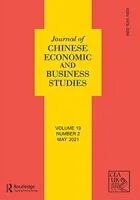

<!-- category: 特刊推荐 -->
<!-- language: 中文 -->
<!-- template: notice-opportunity -->
<!-- review-status: SAMPLE_ONLY_NOT_FOR_PUBLICATION -->

# 历史征稿样例｜当可持续发展遇见金融、历史与机器学习

> JCEBS与 *Sustainability* 曾联合推出“可持续发展跨学科研究前沿”特刊，邀请金融、经济、管理、历史、政治学和社会学等领域的研究者，从不同角度讨论可持续发展与ESG问题。<!-- source:S1 -->

<!-- 编辑提示：原征稿及配套会议属于2022年的历史信息且已经失效 本样例不得作为当前投稿入口
Editor note: The call and associated conference in this sample date from 2022 and have expired Do not use this sample as a current submission route -->

## 历史征稿信息

- **合作期刊：** *Journal of Chinese Economic and Business Studies*（JCEBS）与 *Sustainability*<!-- source:S1 -->
- **专题名称：** New Frontiers in the Interdisciplinary Research of Sustainable Development / 可持续发展跨学科研究前沿<!-- source:S1 -->
- **主题范围：** 可持续发展、ESG及其与金融、技术、教育、历史和制度研究的交叉<!-- source:S1 -->
- **历史会议：** 材料曾计划由CEA于2022年在上海组织配套学术会议<!-- source:S1 -->
- **当前状态：** 历史征稿，不得投稿；是否存在新轮次必须查询两本期刊的当前官方页面<!-- source:S1 -->

_图1 JCEBS历史封面_
<!-- caption-decision: user-confirmed-add -->
<!-- image-source: S1, 历史公众号文章 -->

## 背景与主题：为什么强调“跨学科”？

可持续发展问题同时涉及资源配置、企业激励、技术选择、公共政策、社会规范和代际公平。单一学科可以解释其中一部分，却很难独立回答全部问题。例如，碳中和政策需要经济学分析成本与激励，也需要金融研究讨论资本如何进入绿色项目；机器学习可以改进风险测量，但算法使用还会带来数据偏差、可解释性与治理问题。<!-- source:S1 -->

历史征稿因此把“跨学科参与”设为核心。它不只是把多个流行关键词并排放在标题中，而是希望研究在问题、理论、数据或方法层面建立真正连接。一个使用机器学习预测排放的研究，如果不解释预测如何进入决策，跨学科贡献仍然有限；一篇讨论ESG与性别平等的文章，也需要清楚说明制度机制和可检验结果。

## 适合哪些研究问题与选题？

原征稿列出的方向包括：可持续发展中的大数据、数字时代的可持续性教育、机器学习在可持续发展中的应用、气候变化与碳中和政策、历史与可持续发展、历史流行病和新冠疫情与可持续发展、ESG与性别平等，以及法律、金融与经济增长。<!-- source:S1 -->

这些方向可以进一步转化为更具体的问题：数字数据能否改善企业环境表现测量，算法是否会系统性低估某类气候风险，碳政策如何影响企业投资和地区就业，历史冲击如何改变长期公共卫生或社会韧性，治理制度又如何影响绿色金融资金的配置效率。好的投稿不是简单说明议题“重要”，而是给出清楚的机制、识别策略与证据。

从学科匹配看，会计与金融研究者可以关注ESG披露、绿色资产定价和公司治理；经济学研究者可以分析政策激励、增长、分配和外部性；管理学研究者可以讨论组织转型与创新；历史、政治学和社会学研究则可以解释制度形成、权力关系与长期社会结果。原材料特别鼓励不同学科的青年研究者参与。<!-- source:S1 -->

## 客座编辑与学术组织

历史材料列出的客座编辑包括Yizhe Dong、Jiandong Chen、Chen Wang、Yun Zhang、Wenlong Zhang和Wenxuan Hou。姓名、单位、分工和当前身份应以当时特刊页面为准；如果新一轮征稿使用相似主题，也不能自动沿用这份名单。<!-- source:S1 -->

配套会议的设计旨在为可持续发展研究提供持续讨论平台。历史材料明确说明：参加会议不是向特刊投稿的必要条件，在研讨会上报告也不保证论文最终发表。这一说明非常重要，因为会议录用、编辑交流和期刊同行评审属于不同程序，推文不应给读者造成“参会即可发表”的印象。<!-- source:S1 -->

## 重要日程与当前征稿状态

原材料把配套会议安排在2022年，并围绕当时的征稿周期提供投稿信息。相关日期、影响因子、CiteScore、审稿时长、费用和数据库收录信息都具有强时效性，本样例不重复这些历史数值。<!-- source:S1 -->

真实特刊推荐必须至少核对：征稿页面是否仍在线；专题状态是开放、延期、关闭还是已出版；摘要或全文截止日期；是否滚动审稿；文章处理费和减免政策；稿件类型及字数；投稿系统中的专题选择方式；客座编辑与联系邮箱。任何字段只来自旧推文而没有当前期刊页面时，都应判为阻断项。

## 如何参与：把选题变成可投稿的研究

如果存在新的官方征稿轮次，可按以下路径准备：

1. 阅读特刊官网和目标期刊范围，确认自己的问题真正落在专题与期刊的交集。
2. 用一段话说明研究问题、跨学科连接和新增证据，避免只靠主题关键词匹配。
3. 核对稿件类型、格式、数据与伦理声明、开放获取费用及截止时区。
4. 通过期刊官方投稿系统提交，确认专题名称和客座编辑选项无误。
5. 保存投稿确认，并把官网版本、访问日期和任何编辑通知记录进来源台账。

历史材料中的投稿链接不在本样例中重复，以避免读者误入过期入口。正式稿可以提供链接，但必须在生成当日实际打开，并检查域名属于期刊或出版商官方系统。

## 如何判断自己的稿件是否匹配？

可以用三个问题自检。第一，文章是否提出了可持续发展领域的明确问题，而不是把ESG作为背景标签？第二，跨学科元素是否改变了理论、数据、方法或解释，而非只在文献综述中同时引用多个领域？第三，研究是否清楚说明适用范围、因果识别或预测边界？如果答案仍不明确，优先修改研究设计，而不是急于套用特刊题目。

<!-- 编辑提示：请在公众号编辑器内从已发布的往期文章复制完整固定结尾 包括往期精彩文章 CEA介绍 JCEBS介绍和关注提示
Editor note: In the WeChat editor copy the complete fixed ending from a previously published article including Previous Highlights the CEA introduction the JCEBS introduction and the follow prompt -->

<!-- 图片来源：QR_code-png/扫码_搜索联合传播样式-标准色版.png
Image source: QR_code-png/扫码_搜索联合传播样式-标准色版.png -->
<!-- image-source: 品牌资产 QR_code-png/扫码_搜索联合传播样式-标准色版.png -->
